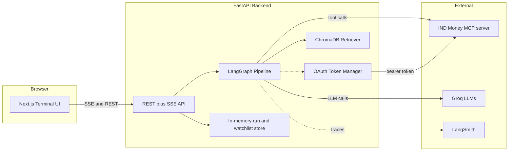
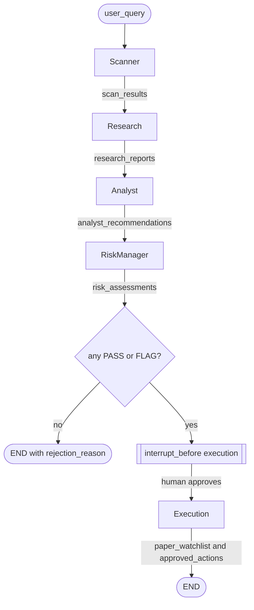
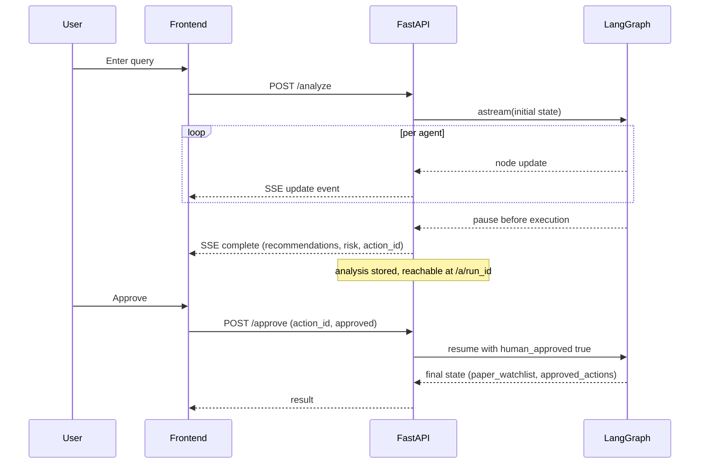
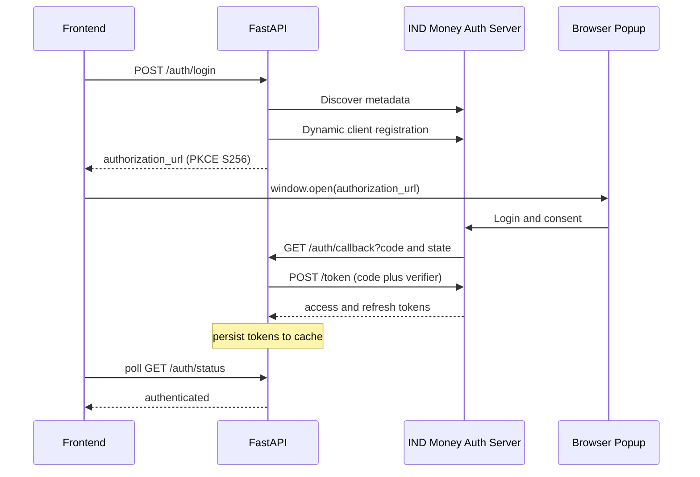
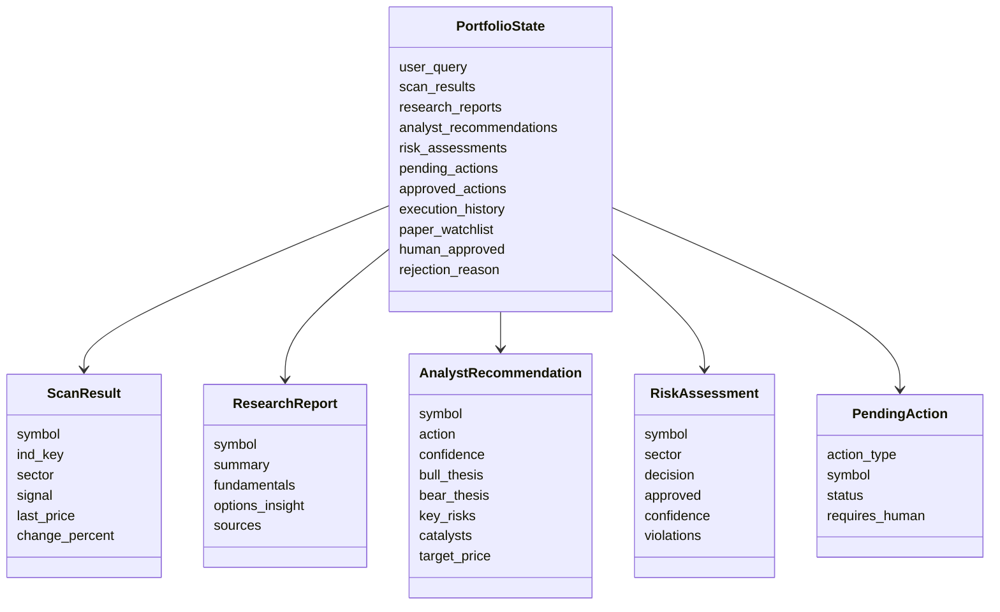

# AlphaDesk

AlphaDesk is a multi-agent Indian equity research system built with LangGraph. It
works like an automated research desk: it scans the NSE market, researches
candidates, writes structured analyst reports, enforces risk guardrails, and
requires human approval before adding any stock to a paper watchlist.

Market data comes from the IND Money MCP server (read only). Language reasoning
runs on Groq. The frontend is a dark, Bloomberg-terminal-style Next.js app.

> No real orders are ever placed. Order placement is out of scope; the broker
> layer is a stub for future integration.

## Table of contents

- [Features](#features)
- [Architecture](#architecture)
- [The agent pipeline](#the-agent-pipeline)
- [Human in the loop and approval](#human-in-the-loop-and-approval)
- [IND Money MCP and OAuth](#ind-money-mcp-and-oauth)
- [Shared state model](#shared-state-model)
- [Tech stack](#tech-stack)
- [Project structure](#project-structure)
- [API reference](#api-reference)
- [Frontend](#frontend)
- [Getting started](#getting-started)
- [Environment variables](#environment-variables)
- [Guardrails](#guardrails)
- [Observability](#observability)
- [Extending the system](#extending-the-system)
- [Limitations](#limitations)

## Features

- Five specialized agents wired into a single LangGraph: Scanner, Research,
  Analyst, RiskManager, Execution.
- Natural language queries. Ask for a theme ("momentum stocks in IT") or name
  explicit tickers ("Analyse NDTV, Zee, Sun TV").
- Server Sent Events stream each agent's progress to the UI in real time.
- Risk guardrails: minimum confidence, maximum stocks per sector, and a human
  approval gate before anything reaches the watchlist.
- Paper watchlist maintained inside AlphaDesk, since the IND Money MCP is read
  only and cannot modify real broker watchlists.
- Retrieval augmented generation over NSE filing PDFs using ChromaDB with a local
  ONNX MiniLM embedding model (no torch, no paid embedding API).
- Full OAuth support for the IND Money MCP, including an in app "Connect" button
  that runs the authorization code plus PKCE flow with dynamic client
  registration.
- Every analysis is persisted server side and reachable at a shareable URL, so a
  page refresh does not lose the results.
- LangSmith tracing on by default for observability.

## Architecture



The browser talks only to the FastAPI backend. The backend runs the LangGraph
pipeline, calls the IND Money MCP for market data (authenticated by the OAuth
manager), calls Groq for reasoning, and queries ChromaDB for filing context.

## The agent pipeline

The graph is a linear pipeline with one conditional branch and one human gate.



Each agent is a pure asynchronous function with the signature
`async (state: PortfolioState) -> PortfolioState`. It reads from the shared state,
adds its output, and returns the state.

| Agent | Model | Responsibility | IND Money tools |
| ----- | ----- | -------------- | --------------- |
| Scanner | llama-3.1-8b-instant | Read query intent, scan movers by category and resolve named tickers | get_indian_stocks_movers, lookup_ind_keys, get_indian_stocks_details |
| Research | llama-3.1-8b-instant | Deep dive per candidate, compile fundamentals and options notes | get_indian_stocks_details, get_indian_stocks_option_chain, get_indian_stocks_greeks_history |
| Analyst | llama-3.3-70b-versatile | Synthesize bull and bear thesis, target, confidence, risks, catalysts | RAG retriever |
| RiskManager | llama-3.3-70b-versatile | Enforce guardrails, assign PASS, FLAG, or REJECT | pure logic on state, LLM for notes |
| Execution | none | Stage approved stocks into the paper watchlist behind the human gate | none |

Scanner intent: the query is routed by the lightweight model into a set of mover
categories (such as top-gainers or most-active) and a set of explicit symbols. If
the query names stocks, AlphaDesk returns only those stocks, resolving each name
to its IND Money `ind_key` with one lookup per name. Otherwise it scans movers.

## Human in the loop and approval

The graph is compiled with `interrupt_before=["execution"]`, so it pauses before
the Execution agent runs. The frontend shows the recommendations and an approval
prompt. Nothing is staged until a human approves.



On approval, the Execution agent stages every recommendation that cleared the
guardrails into `pending_actions`, adds the symbols to `paper_watchlist`, then
moves the actions into `approved_actions`. If a broker adapter were configured it
would call `broker.place_order`; with no broker it logs and persists only.

## IND Money MCP and OAuth

All market data flows through the IND Money MCP server over streamable HTTP. Two
facts shape the integration:

1. Every instrument is keyed by `ind_key` (for example `INDS00577`), not by
   ticker symbol. Tickers are resolved with `lookup_ind_keys`.
2. The server authenticates with OAuth 2.0. Access tokens expire about hourly and
   are refreshed automatically with the stored refresh token. Responses are
   wrapped as `{"result": "<stringified JSON>"}` and unwrapped by the client.

The token manager (`backend/tools/ind_money_auth.py`) keeps a valid bearer token,
refreshing on demand and persisting rotated tokens to a local cache file. It can
seed credentials from environment variables, from its own cache, or from an
existing Claude Code `indmoney` login.

For a fresh machine, the in app Connect button drives the full login flow:



The login registers its own client bound to the backend redirect URI, so it does
not interfere with the Claude Code session. After a successful exchange, the
backend owns its own refresh chain.

## Shared state model

A single Pydantic model, `PortfolioState`, flows through every node. Defined in
`backend/graph/state.py`.



`research_reports` is a dictionary keyed by symbol. The action and risk decisions
are constrained values: action is one of buy, hold, or avoid; decision is one of
PASS, FLAG, or REJECT.

## Tech stack

- Backend: Python 3.11 or newer, LangGraph, FastAPI, ChromaDB, httpx, Pydantic.
- LLM: Groq via langchain-groq. llama-3.3-70b-versatile for Analyst and
  RiskManager, llama-3.1-8b-instant for Scanner and lightweight tasks.
- Market data: IND Money MCP server, accessed with the `mcp` Python SDK.
- RAG: ChromaDB with the built in ONNX MiniLM embedding function.
- Frontend: Next.js 15, TypeScript, Tailwind CSS, shadcn/ui (new-york), lucide
  icons.
- Observability: LangSmith.

## Project structure

```
alphadesk/
├── README.md
├── requirements.txt
├── backend/
│   ├── agents/
│   │   ├── scanner.py          # query intent, market scan, candidate selection
│   │   ├── research.py         # per candidate deep dive
│   │   ├── analyst.py          # structured recommendation with RAG context
│   │   ├── risk_manager.py     # guardrail enforcement, PASS / FLAG / REJECT
│   │   └── execution.py        # human gated paper watchlist staging
│   ├── tools/
│   │   ├── ind_money.py        # IND Money MCP wrapped as LangGraph tools
│   │   └── ind_money_auth.py   # OAuth token refresh and interactive login
│   ├── broker/
│   │   ├── base.py             # BrokerAdapter abstract class and loader (stub)
│   │   └── README.md
│   ├── graph/
│   │   ├── state.py            # PortfolioState and nested Pydantic models
│   │   └── graph.py            # nodes, edges, conditional routing, HiTL gate
│   ├── rag/
│   │   ├── ingest.py           # load and chunk NSE PDFs into ChromaDB
│   │   └── retriever.py        # semantic search over the nse_filings collection
│   ├── api/
│   │   └── main.py             # FastAPI app: SSE, approval, auth, persistence
│   └── evals/
│       └── test_cases.py
├── frontend/
│   ├── app/
│   │   ├── page.tsx            # home: query bar and live dashboard
│   │   ├── a/[id]/page.tsx     # persisted analysis view
│   │   └── layout.tsx
│   ├── components/             # TopBar, AuthButton, WatchlistButton, dashboard,
│   │   └── ui/                 # RecommendationCard, ApprovalModal, and shadcn ui
│   └── lib/
│       ├── api.ts              # typed SSE and REST client
│       └── utils.ts
└── data/
    └── nse_docs/               # PDFs for RAG ingestion
```

The ChromaDB vector store and the OAuth token cache are written under `data/` and
`backend/` at runtime and are git ignored.

## API reference

Base URL defaults to `http://127.0.0.1:8000`.

| Method | Path | Purpose |
| ------ | ---- | ------- |
| GET | `/` | Health check |
| POST | `/analyze` | Run the pipeline, stream agent updates as Server Sent Events |
| POST | `/approve` | Approve or reject the staged batch and resume the graph |
| GET | `/status/{run_id}` | Current state of a run |
| GET | `/analyses` | List stored analyses, most recent first |
| GET | `/analysis/{run_id}` | Full stored analysis for the /a/run_id view |
| GET | `/watchlist` | Cumulative paper watchlist |
| DELETE | `/watchlist/{symbol}` | Remove a symbol from the paper watchlist |
| GET | `/auth/status` | Whether the backend is authenticated with IND Money |
| POST | `/auth/login` | Begin OAuth login, returns the authorization URL |
| GET | `/auth/callback` | OAuth redirect target, exchanges the code for tokens |

The `/analyze` stream emits `start`, then one `update` per agent, then a
`complete` event carrying the recommendations, risk assessments, and an
`action_id` when the run is awaiting approval. Errors arrive as an `error` event.

## Frontend

The UI is a single page terminal styled application.

- `app/page.tsx` is the home view. It holds a command line style query bar and, on
  submit, renders the live dashboard. When a run starts, the URL is updated to
  `/a/<run_id>` so a refresh reopens the analysis.
- `app/a/[id]/page.tsx` loads a stored analysis from the backend and renders the
  same recommendation cards and approval flow, so analyses survive a refresh and
  can be shared by URL.
- `ResultsDashboard` consumes the `/analyze` SSE stream and drives the five stage
  pipeline rail in real time.
- `RecommendationCard` shows the bull and bear thesis, target price, confidence,
  and two badges. The green badge is the Analyst call; the flag badge is the
  RiskManager verdict. Hovering a badge explains it.
- `ApprovalModal` lists the stocks that cleared the guardrails and calls
  `/approve`.
- The top bar carries a Connect IND Money button, a Watchlist viewer, a GitHub
  link, and a live indicator.

## Getting started

Prerequisites: Python 3.11 or newer, Node.js 18 or newer, a Groq API key, and
access to the IND Money MCP server.

### Backend

```bash
python -m venv .venv
# Windows PowerShell
.\.venv\Scripts\Activate.ps1
# macOS or Linux
# source .venv/bin/activate

pip install -r requirements.txt

cp backend/.env.example backend/.env   # then fill in the values

# optional: ingest NSE PDFs placed in data/nse_docs into ChromaDB
cd backend
python -m rag.ingest

# run the API
uvicorn api.main:app --reload --port 8000
```

The interactive API docs are served at `http://127.0.0.1:8000/docs`.

### Frontend

```bash
cd frontend
npm install
cp .env.local.example .env.local       # optional, has sane defaults
npm run dev                             # http://localhost:3000
```

The backend already allows the localhost and 127.0.0.1 origins on port 3000.

### Authenticate with IND Money

Open the app and click Connect IND Money in the top bar. A popup opens the IND
Money login. After you consent, the button turns green and the backend holds its
own refresh chain.

## Environment variables

Backend, in `backend/.env`:

| Variable | Required | Description |
| -------- | -------- | ----------- |
| `GROQ_API_KEY` | yes | Groq API key for all LLM calls |
| `IND_MONEY_MCP_URL` | yes | Streamable HTTP URL of the IND Money MCP server |
| `LANGCHAIN_API_KEY` | recommended | LangSmith key for tracing |
| `LANGCHAIN_TRACING_V2` | recommended | Set to true to enable tracing |
| `LANGCHAIN_PROJECT` | optional | LangSmith project name |
| `IND_MONEY_OAUTH_CLIENT_ID` | optional | Dedicated OAuth client id |
| `IND_MONEY_OAUTH_REFRESH_TOKEN` | optional | Dedicated OAuth refresh token seed |
| `IND_MONEY_OAUTH_SCOPE` | optional | OAuth scope, defaults to portfolio:read |
| `IND_MONEY_MCP_TOKEN` | optional | Static bearer token, skips refresh |
| `IND_MONEY_AUTH_REDIRECT` | optional | OAuth redirect URI for the login button |
| `BROKER` | optional | Broker name; leave blank for paper only |

Frontend, in `frontend/.env.local`:

| Variable | Description |
| -------- | ----------- |
| `NEXT_PUBLIC_API_URL` | Backend base URL, defaults to http://127.0.0.1:8000 |

## Guardrails

Enforced by the RiskManager:

- Minimum confidence to proceed: 0.70. Below this the stock is rejected.
- Maximum stocks per known sector: 3. Stocks with an unknown sector are exempt.
- A recommendation with an analyst action of avoid is rejected.
- Any transition from `pending_actions` to `approved_actions` requires
  `human_approved` to be true.

A recommendation that clears the guardrails with confidence below 0.75 is marked
FLAG rather than PASS. FLAG is a caution label, not a separate gate; flagged
stocks are still approvable.

## Observability

LangSmith tracing is controlled by environment variables and is intended to stay
on. Each run is given a stable id that is passed to LangGraph as the run id, so it
becomes the LangSmith trace root and the same id is used as the checkpointer
thread id and the application run handle.

## Extending the system

Order placement is intentionally out of scope. The interface for a future broker
lives in `backend/broker/base.py` as the `BrokerAdapter` abstract class with a
`load_broker` factory. To add a broker, for example Dhan:

1. Create `backend/broker/dhan.py` implementing `BrokerAdapter`.
2. Set `BROKER=dhan` in the backend environment.
3. The Execution agent already calls `broker.place_order` when a broker is
   configured, so no agent changes are needed.
4. Add a human confirmation step for order value above a chosen threshold.

Without a broker, approved actions remain in `approved_actions` and stocks remain
in the paper watchlist. No orders are placed.

## Limitations

- The IND Money MCP is read only. AlphaDesk cannot modify your real broker
  watchlist, so it maintains its own paper watchlist.
- Run history, the paper watchlist, and stored analyses live in memory on the
  backend. They survive a browser refresh but not a backend restart. Swap the in
  memory stores for a file or database to make them durable.
- Scanned or image only PDFs are not parsed for RAG, since extraction is text
  based with no OCR.
- The MemorySaver checkpointer is in process. Use a persistent checkpointer for a
  production deployment.
